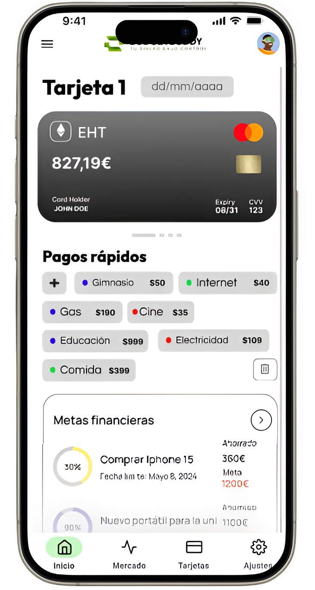

<div align="center">


# BudgetBuddy

**App de finanzas personales para estudiantes**

[]()
[]()
[]()
[]()
[]()

</div>

---

## Sobre BudgetBuddy

BudgetBuddy es una aplicación web de gestión financiera diseñada para estudiantes. Implementa el **sistema de sobres** (envelope budgeting) para organizar presupuestos, junto con tracking de gastos/ingresos y un dashboard educativo de mercado con datos de ETFs en tiempo real.

<div align="center">

</div>

## Funcionalidades

- **Gestión de cuentas bancarias** con IBAN y saldo en tiempo real
- **Sistema de sobres** (envelope budgeting) con asignación y objetivo por categoría
- **Tarjetas Visa/Mastercard** con panel de detalle, estadísticas y almacenamiento cifrado del número completo
- **Movimientos** — gastos, ingresos y traspasos entre cuentas
- **Etiquetas con colores** para categorizar movimientos
- **Dashboard de mercado** educativo con cotizaciones de ETFs (Alpha Vantage)
- **Dark mode** con tres modos: light, dark y auto (sigue el sistema)
- **Navegación SPA-like** sin recargas de página completa
- **Responsive completo** optimizado para móvil y escritorio

## Tech Stack

| Tecnología | Uso |
|---|---|
| **Laravel 12** | Framework backend (PHP 8.2) |
| **MySQL 8.0** | Base de datos |
| **Nginx** | Reverse proxy |
| **Docker Compose** | Orquestación (4 servicios) |
| **Sanctum** | Autenticación cookie-based |
| **Blade** | Motor de plantillas (SSR) |
| **Chart.js** | Gráficas del dashboard de mercado |

## Requisitos previos

- [Docker](https://docs.docker.com/get-docker/) y Docker Compose
- [Git](https://git-scm.com/)

## Instalacion rapida

```bash
git clone https://github.com/anna3589/RETO-02-BudgetBuddy.git
cd RETO-02-BudgetBuddy

# Configurar credenciales MySQL
cp .env.docker.example .env.docker

# Levantar los 4 servicios
docker compose up -d --build

# Acceder en http://localhost
```

> La primera ejecución genera automáticamente el `.env` de Laravel y ejecuta migraciones.

## Novedades

### v2.4.0 — 12 Mar 2026

- **Etiquetas por usuario**: cada usuario tiene sus propias etiquetas (antes eran globales compartidas). Limite de 50 por usuario. Nombre unico por usuario.
- **Validacion de saldo en sobres**: al crear o editar una meta financiera, se valida que la suma de asignaciones no exceda el saldo de la cuenta.
- **Indices de base de datos**: indices compuestos en `movements(account_id, date)` y `movements(account_id, type)` para mejorar rendimiento de consultas.
- **Fix crear multiples metas**: el campo "Ahorrado" vacio provocaba un error 422 silencioso al crear la segunda meta.

### v2.3.0 — 12 Mar 2026

- **Numero completo y CVC en tarjetas**: almacenamiento cifrado (Laravel `encrypted` cast) del numero completo (obligatorio, formateado en grupos de 4) y CVC (3 digitos, obligatorio). Campos ocultos por defecto (`$hidden`), revelables mediante verificacion de contraseña (`POST /api/cards/{id}/reveal`). Boton copiar al portapapeles. Ultimos 4 digitos auto-calculados (readonly).
- **Limpieza completa de idioma**: traducidos ~80 comentarios de ucraniano a español en 10 archivos (JS, CSS, PHP, migraciones).
- **Eliminado codigo muerto**: `country_code` en AccountController, funcion `updateDate()` y display de fecha actual en tarjetas/estadisticas, CSS `.date-container` y variable `--date-bg`.
- **Validacion de fecha de caducidad**: las tarjetas ya no aceptan fechas pasadas (`after_or_equal:today`).
- **Timeout en navegacion PJAX**: `AbortController` con timeout de 6s en fetch + safety timeout de 8s para liberar estado bloqueado.
- **Fix setup wizard**: eliminado `required` del input de caducidad de tarjeta (era opcional pero bloqueaba el envio del formulario).
- **Fix movimientos**: corregido envio de importe negativo que provocaba error 422 silencioso.
- **Fix boton "Añadir tarjeta"**: el boton de estado vacio quedaba cortado por `overflow: hidden` del contenedor.

### v2.2.1 — 12 Mar 2026

- **Rediseño completo "Mis Tarjetas"**: layout 2 columnas con carrusel de tarjetas (izquierda) y panel de detalle con estadísticas (derecha). Transacciones full-width independiente debajo. Función `renderCardDetail()` con grid 2x2 de stats (saldo, movimientos, gastos, ingresos). Highlight de tarjeta seleccionada. Responsive a 1 columna en pantallas pequeñas.

### v2.2.0 — 11 Mar 2026

- **Toggle dark mode manual** (light/dark/auto) con persistencia en localStorage y prevención de FOUC
- **Responsive mejorado**: tarjetas en móvil convertidas a cards CSS-only, mini-cards con swipe, filtros touch-friendly (44px)
- **Mejora estética completa**: design tokens expandidos (grises, sombras, radios, transiciones), header glassmorphism, sidebar con pill indicator, botones con `:disabled` y `:focus-visible`, `prefers-reduced-motion` global
- **Modularización JS**: creados `core/` (formatters, utils, api-client, theme-toggle, notifications) y `modules/` (drag-drop). Eliminados archivos legacy
- **Refactorización CSS**: extraídos 5 archivos compartidos `app-*.css`, reducción total del -35% en tamaño CSS

### v2.1.0 — 7 Mar 2026

- **Migración landing page a Blade**: eliminación completa del servicio frontend y directorio `frontend/`
- **Navegación SPA-like** con `pjax-nav.js` (transiciones suaves de 150ms entre las 4 páginas de app)
- **Mejoras de accesibilidad**: roles ARIA, focus-visible global, contraste mejorado
- **Video optimizado** con subtítulos VTT en español

### v2.0.0 — Lanzamiento inicial

- Dashboard principal con cuentas, tarjetas vinculadas, etiquetas y metas
- Sistema de sobres (envelope budgeting) con asignación y objetivo
- Página de tarjetas con listado de movimientos
- Dashboard educativo de mercado (ETFs vía Alpha Vantage)
- Página de ajustes de perfil de usuario
- Setup wizard de configuración inicial (4 pasos)
- Autenticación con Laravel Sanctum
- CI con GitHub Actions

## Estructura del proyecto

```
RETO-02-BudgetBuddy/
├── backend/              # Laravel 12 application
│   ├── app/              # Controllers, Models, Middleware
│   ├── public/           # CSS, JS, images, video
│   │   ├── css/          # Estilos compartidos (app-*.css) y de página
│   │   ├── js/           # core/, modules/, scripts de página
│   │   └── images/       # Logos, iconos, wireframes
│   ├── resources/views/  # Blade templates
│   │   ├── layouts/      # budgetbuddy.blade.php (shell principal)
│   │   └── components/   # Header, sidebar, mobile nav
│   └── routes/           # web.php, api.php
├── nginx/                # Reverse proxy config
├── docker-compose.yml    # 4 servicios: nginx, backend, db, phpmyadmin
└── README.md
```

## Equipo

Proyecto desarrollado como reto formativo.

Repositorio: [github.com/anna3589/RETO-02-BudgetBuddy](https://github.com/anna3589/RETO-02-BudgetBuddy)

## Licencia

Este proyecto está bajo la licencia [MIT](LICENSE).
